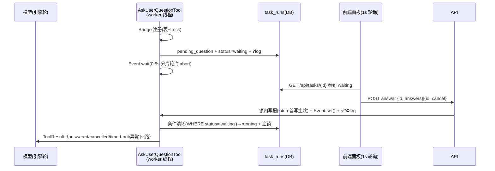

# Architecture Spine — 技能交互 L2：AskUser 工具 + 任务暂停/恢复

## Design Paradigm

单进程双层线程模型不变：任务层是事件循环上的 asyncio.Task，引擎层是 `asyncio.to_thread` 里的 worker 线程同步生成器。L2 在其上加一条**跨线程问题桥**，职责二分：

> **可见性走 DB，唤醒走 Event。** DB（`task_runs.payload.pending_question` + `status=waiting`）只服务 UI 可见性与留痕；答案向工具的传递只走进程内桥（Event + 答案槽），绝不经 DB 回读。

## Invariants & Rules

### AD-1 — 状态机与条件清场 `[ADOPTED]`

- **Binds:** FR-2, FR-3, FR-4, all
- **Prevents:** 「waiting 但无问题」「running 却挂着 pending_question」僵尸；清场与终态/孤儿清扫的写序竞态互相覆盖
- **Rule:** `status ∈ {running, waiting, success, failed}`。**waiting↔running 翻转只由工具侧发起，且一律条件更新**（`UPDATE … WHERE id=? AND status='waiting'`，谁跑得晚谁自然空操作）。**终态（success/failed）与孤儿清扫沿任务层/启动层现状写入，不受单写者限制**，但写终态/清扫时须顺手清 `pending_question` 并注销桥（兜底：工具 try/finally 清场（AD-5）之外的第二道网）。不变量（读侧语义）：`waiting ⇒ pending_question 非空 ∧ 桥已注册`；`finished_at 非空 ⇒ 不渲染待答表单`。

### AD-2 — 跨线程问题桥

- **Binds:** FR-1, FR-2, FR-3
- **Prevents:** 一套实现走 DB 轮询取答案、另一套走 Event 的分叉；跨线程答案竞态；重复提交覆盖首答
- **Rule:** 模块级注册表 `{task_id → Bridge}` + `threading.Lock`；`Bridge` 持有 `threading.Event`、答案槽（**首写生效 latch：已有答案/取消再写返回 409**）、deadline、abort 标志。工具侧次序：**注册 → 写 DB**（问题 + waiting + `❓` 留痕）→ `wait`（0.5s 分片轮询 abort）→ 取结果 → 注销。端点侧：查注册表（**无桥 → 409**；DB waiting 但无桥 = 重启僵尸/终态竞态窗口，统一 409）→ 校验问题 id → 锁内写槽（latch）→ `set()` + `✅/⛔` 留痕。**cancel 与 answer 并发：锁内先到者生效，后到 409。**

### AD-3 — 单问串行与问题标识

- **Binds:** FR-1, FR-3
- **Prevents:** 并发多问导致答案归属歧义
- **Rule:** 工具 `is_read_only() → False`（**注意与 vendor 版相反**：vendor `AskUserQuestionTool.is_read_only()` 返回 True（TUI 语义），平台版取 False 正是为借引擎「非只读工具独立成批串行单跑」机制——**禁止直接 import vendor 工具顶替**，否则同轮两问会被只读并行批拉起）。`pending_question.id` 每问唯一（uuid），answer 请求顶层携带该 id（见 AD-6），不匹配或已 latch 409。多轮问 = 多次工具调用，每轮新 id。

### AD-4 — 挂载矩阵与提示词落点

- **Binds:** FR-1
- **Prevents:** 全局挂载泄漏到无人值守流水线；默认提示词描述不存在的工具
- **Rule:** `agent_sdk.run(..., task_id: str | None, interactive: bool = False)`；`interactive=True` 时工具列表追加 `AskUserQuestionTool`。**传 True 的汇点是 `skill_runner.run_prompt`**（技能 invoke 与 AI 命令栏的共同入口，api.py 两端点自然获得，无需各自传参）；`scaffold_builder` 直调 `run()` 保持默认 False。默认 `_system_prompt()` 的工具手册段**按 interactive 动态生成**（挂了才写 AskUserQuestion 用法与「何时该问」约束段）；scaffold 走覆盖式 system_prompt 不受影响。工具实现在 `app/services/askuser.py`，vendor/cc-mini 保持上游只读。

### AD-5 — 退出路径与清场兜底

- **Binds:** FR-1, FR-2, NFR 超时
- **Prevents:** 超时/中止后 worker 线程永久悬挂；异常路径 waiting+桥残留成无人消费僵尸；退出文案不一致
- **Rule:** 工具 `execute()` 全程 **try/finally**，finally 清场（条件更新回 running + 清 pending_question + 注销桥）。退出四路：**answered**（`User answered:\n{q} => {a}`，对齐 vendor 文案）；**cancelled**（`User cancelled the question.`，`is_error=True`）；**timed-out**（等待超时说明，`is_error=True`）；**异常**（execute 内部异常转 `is_error` ToolResult 返回，不得上抛——引擎 `_execute_tool` 会吞异常导致跳过清场，故清场必须进 finally）。`deadline = skill_run_timeout 剩余额度`（`run()` 构造工具时注入）。

### AD-6 — 数据与留痕契约

- **Binds:** FR-2, FR-3, FR-4
- **Prevents:** 前后端各猜各的形状；多轮问答案错接
- **Rule:**
  - `payload.pending_question = {"id": str, "questions": [{"question": str, "options": [{"label", "description"}], "multiSelect": bool}], "asked_at": iso-UTC}`
  - 请求：`{"id": str, "answers": [{"question": str, "answer": str}]}` 或 `{"id": str, "cancel": true}`（**顶层 id = pending_question.id**）；`answer` 恒为字符串（multiSelect 由前端拼接）
  - 响应：200 成功投递；404 无任务；409 非 waiting / 无桥 / id 不匹配 / 已 latch
  - logs 前缀：问 `❓`、答 `✅ 应答：…`、取消 `⛔ 用户取消了应答`

### AD-7 — 前端接管规则

- **Binds:** FR-4
- **Prevents:** waiting 任务被轮询逻辑当完结丢弃；刷新后丢管道；waiting 误显终态 UI
- **Rule:** `focusTask` 1s 定向轮询与 `pollOnce` 3s 通用扫描均视 `waiting` 为「仍在跟踪」；提交/取消后本地乐观清表单并标记已答（**抑制轮询重渲染**，桥 latch 已保证后端不重复消费）；409 时重拉任务态。elapsed 冻结 = 记 waiting 区间，恢复后扣除。**状态机触点清单**（故事的逐点验收项）：① `focusTask` 停轮条件（`!['running','waiting'].includes`）② `pollOnce` 接管过滤 ③ `pollOnce` 终态补拉条件（现 `status==='running'` 不命中 waiting，App.vue:1992 一带）④ 面板 `.task-foot` 的 `v-if!=='running'`（waiting 误显终态 footer，App.vue:48 一带）⑤ `_fail_orphan_tasks` 扫 `running+waiting`（并清 pending_question）⑥ 状态 tag 映射（含 skillTasks 表）与 elapsed 标签 ⑦ `models.py` 状态注释与写入点 ⑧ `apiPost` 错误透出 status 码（现吞错无码，「409 分支」需要它——answerTask 至少要拿到 status）。

### AD-8 — run() 接线契约

- **Binds:** FR-1, FR-2, AD-2/4/5 的可实施性
- **Prevents:** 桥注册键（task_id）拿不到；超时/中止叫不醒阻塞在 `Event.wait` 的工具（`engine.abort()` 只置引擎私有标志，对工具不可见）
- **Rule:** `agent_sdk.run()` 签名增 `task_id` 与 `interactive`（见 AD-4），`skill_runner.run_prompt` 补传 task_id（现已接收但丢弃）。`run()` 的**超时与异常路径**在 `engine.abort()` 之后必须调 `askuser.abort_bridge(task_id)`：置桥 abort 标志 + `Event.set()`（工具醒来发现 abort 即走 timed-out/清场路径）；有界等待后放弃（线程自清，不阻塞事件循环）。工具构造参数：`(task_id, log_cb, deadline_at)`。



## Consistency Conventions

| Concern | Convention |
| --- | --- |
| 命名 | 工具名 `AskUserQuestion`（对齐 vendor/Claude Code，技能正文双环境通用；平台版自写，is_read_only=False 见 AD-3）；端点 `POST /api/tasks/{id}/answer`；前端 api 方法 `answerTask`；模块 `app/services/askuser.py` |
| 数据格式 | 时间 iso-UTC（SQLite naive 惯例：读侧补 Z 由前端 `parseUTC` 处理）；JSON 列一律整体重赋值；`answer` 恒字符串 |
| 状态与横切 | 留痕走 `_append_log`（封顶 200）；工具 DB 写仅经 tasks.py 同步 helper 模式（每调用独立 session；条件更新同此模式）；权限 `auto_approve` 不变（AskUser 本身即授权通道）；清场幂等（条件更新 + try/finally 双保险） |

## Stack

SEED（全部既有，无新增依赖；版本为实装/声明值，requirements 是 `>=` 下限非锁定）：

| Name | Version |
| --- | --- |
| Python | 3.14.2（现有 .venv 实装） |
| FastAPI / Uvicorn | >=0.115 / >=0.32（requirements.txt 下限；实装 0.141.1 / 0.52.4） |
| threading（Event/Lock，标准库） | — |
| Vue 3 / Element Plus | ^3.5.13 / ^2.9.0（frontend/package.json 区间） |

## Structural Seed

```text
app/
  services/askuser.py        # AskUserQuestionTool + Bridge + 注册表 + 条件清场 helper + abort_bridge
  services/agent_sdk.py      # run() 增 task_id/interactive；_system_prompt 工具段动态化；超时路径调 abort_bridge
  services/skill_runner.py   # run_prompt 补传 task_id + interactive=True（两汇点共用）
  api.py                     # POST /api/tasks/{id}/answer
  tasks.py                   # 终态写入顺手清 pending_question（兜底网）
main.py                      # 项目根：_fail_orphan_tasks 扫 running+waiting 并清 pending_question
frontend/src/
  App.vue                    # 面板 waiting 分支表单 + 触点清单⑧点
  api.js                     # answerTask(id, body)；apiPost 错误透出 status
tests/test_askuser_flow.py   # 桥单测：直跑断言脚本风格（不跑真 LLM）
.claude/skills/ask/SKILL.md  # 冒烟技能：问偏好→按答案产出
```

## Capability → Architecture Map

| Capability / Area | Lives in | Governed by |
| --- | --- | --- |
| FR-1 AskUser 工具 | `askuser.py` + `agent_sdk.run` | AD-2/3/4/5/8，范式 |
| FR-2 waiting 态 | `askuser.py` 清场 helper + `tasks.py`/`main.py` 兜底 | AD-1/2/5/8 |
| FR-3 应答 API | `api.py` | AD-2/3/6 |
| FR-4 前端面板 | `App.vue` + `api.js` | AD-6/7 |
| FR-5 审批门模式 | 技能作者指南（`ask` 技能即示例） | AD-6 文案契约 |
| FR-6 冒烟技能 | `.claude/skills/ask/` | AD-4 挂载 |

## Deferred

- **V6 并发交互任务的可见性**：两个交互任务同时 waiting 时，单面板焦点制会藏住一个（被藏任务最终吃满 3600s 超时）——单人自用低频，接受；如需缓解，任务列表对 waiting 任务加徽标（独立小改动，非本脊柱约束）
- **V11 PlatformAPI 代答**：agent 理论上可 POST answer 代答另一 waiting 任务——单用户自伤型面，接受不设防
- L3 审批问题的前端强调样式（主次按钮/配色）——故事级 UI 细节
- 剩余超时预算在面板的展示形式——展示层细节
- multiSelect 控件具体选型（checkbox 组）与自由输入控件细节——故事级
- `ask` 技能的问题文案与产出形式——技能作者自由度
- waiting 区间扣除的精确实现（前端 vs 后端算好）——故事级
